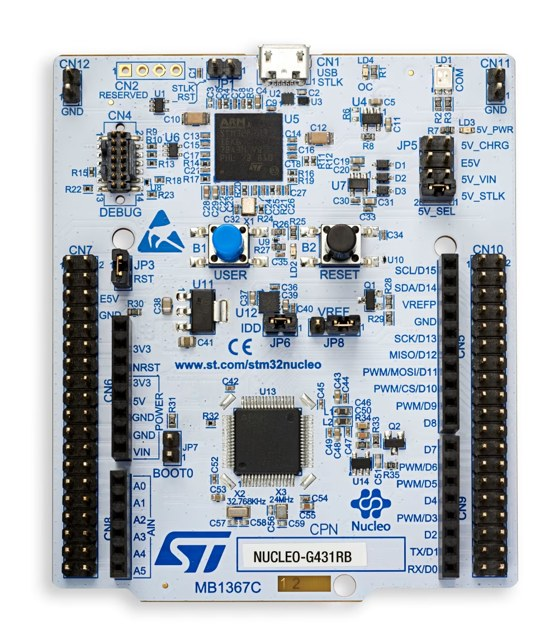
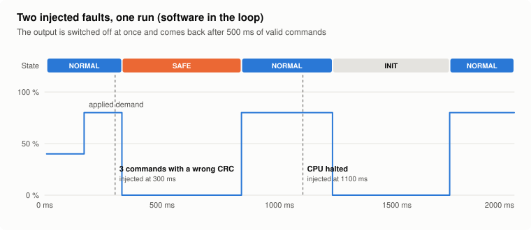
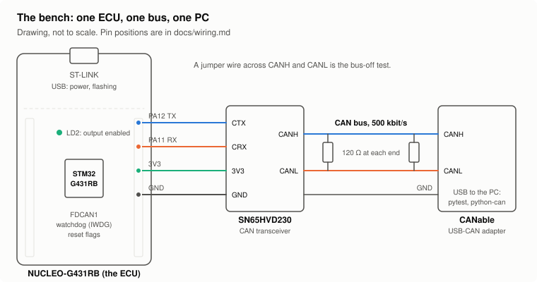
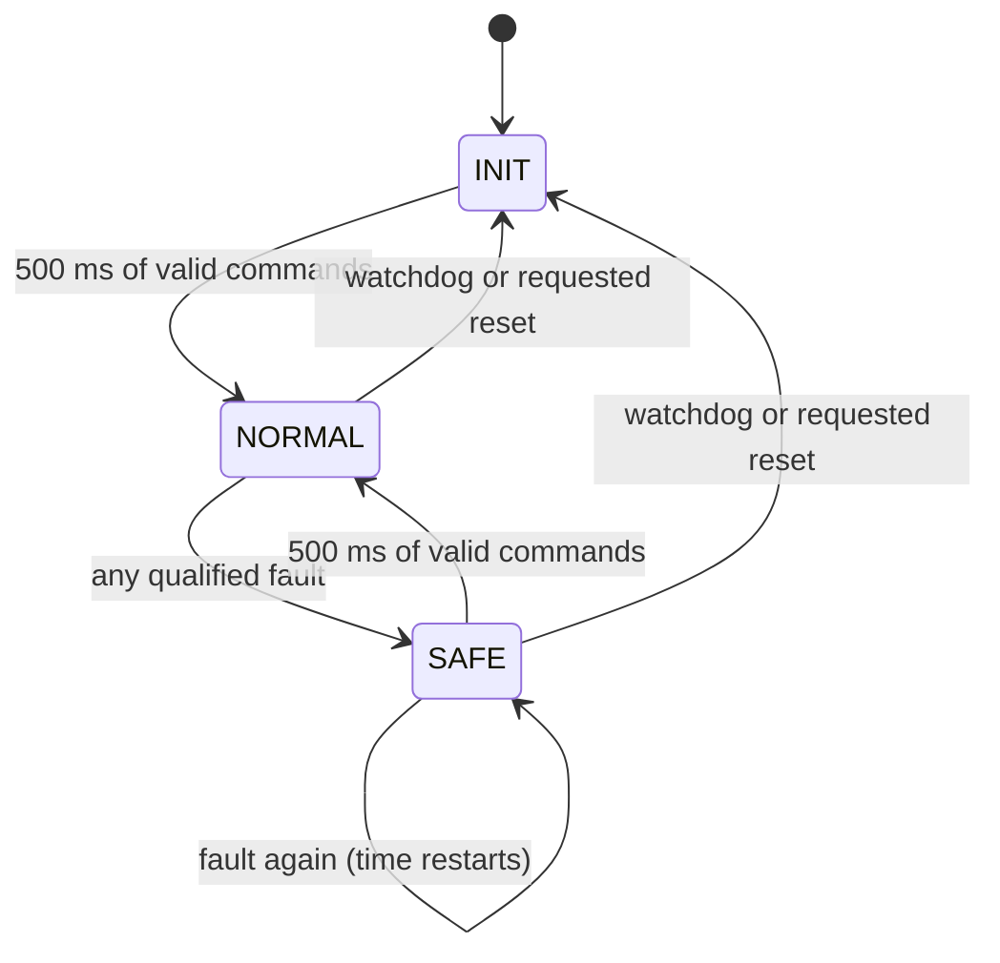
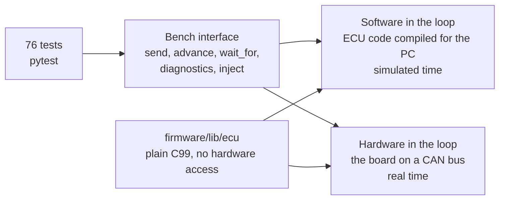
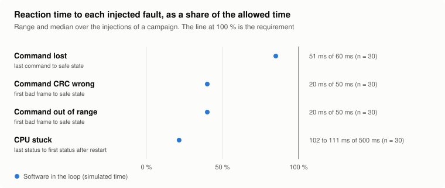

# ECU-Fault-injection

**Do the safety mechanisms of an ECU work when the fault really happens?<br>A fault injection bench for an STM32 ECU, with one test suite for simulation and hardware.**

[](https://github.com/eungyun-im/ecu-fault-injection/actions/workflows/ci.yml)


[Overview](#overview) · [Bench](#the-bench) · [Faults](#faults-and-safety-mechanisms) · [Two targets](#one-test-suite-two-targets) · [Results](#results) · [Layout](#repository-layout) · [Run](#running)

</div>

---

## Overview

<div align="center">



<sub>NUCLEO-G431RB, the ECU of this bench. Photo: STMicroelectronics.</sub>


A safety mechanism is code that runs only when something has gone wrong. Normal operation never exercises it, so the only way to know that it works is to make the fault happen on purpose. ISO 26262-6 lists fault injection among the methods for verifying software for that reason.

This repository is a small bench that does that:

- An **ECU** on an STM32 board controls one actuator output and protects it with a set of safety mechanisms: message timeout, CRC and alive counter on the command, range check, watchdog, deadline monitoring, bus-off recovery, a fault memory that survives a reset.
- A **bench** on the PC plays the rest of the vehicle. It sends the command, corrupts it, withholds it, stops the ECU's CPU, and measures how long the ECU takes to reach its safe state.
- The same tests run on two targets: the ECU code compiled for the PC in simulated time, and the board on a real CAN bus.

> **Status:** the ECU code, the bench, 76 tests and the campaign tool are implemented. Everything runs on the software-in-the-loop target in CI, and the firmware builds for the board. **The run on the board has not been done yet**, so every number below comes from simulation. The alive counter check (SAFE-03) is open.

<picture>
  <source media="(prefers-color-scheme: dark)" srcset="docs/img/scenario-dark.svg">
  
</picture>

## The bench

| Part | Role |
|---|---|
| NUCLEO-G431RB | The ECU: STM32G431 with FDCAN, independent watchdog and an on-board debugger |
| SN65HVD230 module | CAN transceiver |
| CANable | USB-CAN adapter, the PC's access to the bus |
| 2 × 120 Ω, jumper wires | Termination, and the short circuit for the bus-off test |

The whole bench costs about as much as a textbook. It is not a substitute for a HIL rack, and it does not need to be: the faults it injects are the same ones. The test build of the firmware takes 6.8 kB of flash and 408 bytes of RAM.

<picture>
  <source media="(prefers-color-scheme: dark)" srcset="docs/img/bench-wiring-dark.svg">
  
</picture>

Wiring and termination: [`docs/wiring.md`](docs/wiring.md). First run on the board: [`docs/bring_up.md`](docs/bring_up.md).

## Faults and safety mechanisms

Every fault ends in the same place: the **safe state**, with the output off. The output comes back only after 500 ms of valid commands.

| ID | Fault | How it is injected | Mechanism | Limit |
|---|---|---|---|---|
| SAFE-01 | Command lost | The bench stops sending | Timeout monitoring, 50 ms | Safe state within 60 ms |
| SAFE-02 | Command corrupted | The bench sends a wrong CRC | CRC-8 over identifier and data | Safe state on the 3rd bad frame, within 50 ms |
| SAFE-03 | Sender stuck, frames lost or repeated | The bench freezes or skips the alive counter | Alive counter check | Safe state on the 3rd error |
| SAFE-04 | Sender asks for 101 % | A correctly protected but impossible value | Range check | Safe state, value never applied |
| SAFE-07 | CPU stuck | A diagnostic routine stops the program | Watchdog, fed only by the cyclic task | Restart, back on the bus within 500 ms |
| SAFE-08 | | | Reset cause and fault memory survive the reset | DTC and counter after a watchdog restart |
| SAFE-09 | CAN bus-off | A jumper wire across CANH and CANL | Bus-off recovery | Back on the bus within 1 s |
| SAFE-10 | Task runs late | A diagnostic routine holds the task up | Deadline monitoring, 5 ms | Safe state, no restart |

All 20 requirements: [`requirements/requirements.md`](requirements/requirements.md). Message layouts, DTCs and routines: [`docs/can_matrix.md`](docs/can_matrix.md). Which test verifies which requirement, and on which target: [`docs/traceability.md`](docs/traceability.md), generated and checked in CI.



**Fault injection must not ship.** The routines that stop the CPU exist only in a test build, behind a compile-time switch, and only in the extended diagnostic session. A test builds the release variant and checks that every one of them is refused.

**The bench is tested too.** One routine makes the ECU send status frames with a wrong CRC, and a test checks that the bench notices exactly that many. A checker that cannot fail proves nothing.

## One test suite, two targets



The ECU code in [`firmware/lib/ecu`](firmware/lib/ecu) touches no hardware. It calls eleven functions of a small port interface ([`ecu_port.h`](firmware/lib/ecu/ecu_port.h)): send a frame, feed the watchdog, read the reset cause. On the board, [`firmware/src/main.c`](firmware/src/main.c) implements them with the STM32 HAL. On the PC, [`bench/ecu_model.py`](bench/ecu_model.py) implements them with a model of the watchdog, the CPU and the CAN controller.

| | Software in the loop | Hardware in the loop |
|---|---|---|
| Shows | The logic reacts correctly to each event | The event really happens, and how long everything takes |
| Time | Simulated, repeatable, 76 tests in 3 s | Real |
| Runs | In CI, on every push | On the bench |

What only the board can answer is listed in [`docs/measurement.md`](docs/measurement.md): whether the real watchdog fires and when, how long a restart takes, whether the fault memory survives it, whether the internal oscillator is good enough for 500 kbit/s.

Diagnostics use the standard open-source stack on the PC side ([udsoncan](https://github.com/pylessard/python-udsoncan), [can-isotp](https://github.com/pylessard/python-can-isotp), [python-can](https://github.com/hardbyte/python-can)) and a small ISO-TP and UDS server written in C on the ECU side.

## Results

### Software in the loop

| | |
|---|---|
| Tests | 60 passed, 16 skipped (15 wait for SAFE-03, 1 is the manual bus-off test on the board) |
| Requirements with at least one test | 20 of 20 |
| Static analysis (cppcheck, warnings as errors in the build) | no findings |

**Fault injection campaign.** A test says whether a limit was met once. The campaign injects each fault 30 times at different moments in the ECU's cycle and records every reaction time ([`results/campaign_sil.csv`](results/campaign_sil.csv)).

| Fault | Requirement | Runs | Min | Median | Max | Limit | Margin |
|---|---|---|---|---|---|---|---|
| Command lost | SAFE-01 | 30 | 51 ms | 51 ms | 51 ms | 60 ms | 9 ms |
| Command CRC wrong | SAFE-02 | 30 | 20 ms | 20 ms | 20 ms | 50 ms | 30 ms |
| Command out of range | SAFE-04 | 30 | 20 ms | 20 ms | 20 ms | 50 ms | 30 ms |
| CPU stuck | SAFE-07 | 30 | 102 ms | 107.5 ms | 111 ms | 500 ms | 389 ms |

<picture>
  <source media="(prefers-color-scheme: dark)" srcset="docs/img/reaction-times-dark.svg">
  
</picture>

Three of the four have no spread at all. That is not a result about the ECU. It is a property of the simulation, where nothing varies except the moment of injection, and these three reactions are counted in whole command cycles. The numbers are the design values. The spread around them is what the board measurement adds, and the requirement is about its worst case.

**A defect the bench found in its own ECU.** With a trial implementation of the alive counter check, the test "two corrupted frames in a row are tolerated" failed. After two frames with a wrong CRC, the next good frame carried a counter three steps ahead of the last one the ECU had accepted, and was rejected as a counter error. Three errors in a row, safe state, for a disturbance the requirement says to ride through. The fix is in [`monitor.c`](firmware/lib/ecu/monitor.c): a frame with a wrong CRC resets the counter reference. Neither mechanism was wrong alone. The defect was in how they interact.

### On the board

Not run yet. [`docs/hil_results.md`](docs/hil_results.md) is the page that will hold the bench description, the test results, the campaign with its real spread, and the differences between simulation and board.

## Repository layout

```
ecu-fault-injection/
├── requirements/            20 requirements with limits
├── firmware/
│   ├── lib/ecu/             The ECU, plain C99
│   │   ├── ecu.c            Cyclic task: monitoring, state machine, transmit, diagnostics
│   │   ├── monitor.c        Timeout, CRC, counter and range check of the command
│   │   ├── safety.c         INIT, NORMAL, SAFE and the 500 ms rule
│   │   ├── e2e.c            CRC-8 and alive counter
│   │   ├── isotp.c          ISO-TP, both directions, with flow control
│   │   ├── uds.c            UDS server and the fault injection routines
│   │   └── ecu_port.h       What the ECU needs from its platform
│   ├── src/main.c           STM32 port: FDCAN, watchdog, reset flags, backup register
│   └── platformio.ini       Test build and release build
├── bench/
│   ├── base.py              The bench as a test sees it
│   ├── sil.py               Target: ECU code on the PC, simulated time
│   ├── hil.py               Target: the board, through python-can
│   ├── ecu_model.py         Model of watchdog, CPU and CAN controller for the PC target
│   ├── restbus.py           Sends the command, and injects the faults on it
│   ├── campaign.py          Repeated injection and reaction time statistics
│   ├── hello.py             First contact with the board
│   └── virtual_ecu.py       The ECU model on a python-can bus, to test hil.py without a board
├── tests/                   76 tests, each marked with the requirements it verifies
├── tools/                   Traceability matrix, figures
├── results/                 Campaign data
└── docs/                    CAN matrix, wiring, bring-up, measurement, results, defect reports
```

## Running

Software in the loop (needs gcc, so Linux or WSL):

```bash
pip install -r requirements.txt
```

```bash
pytest -v
```

```bash
python -m bench.campaign --runs 30
```

On the board (works from Windows, no gcc needed):

```bash
pio run -d firmware -e test -t upload
```

```bash
pytest --target hil --can-channel COM5 -v
```

The board side of the bench can be tried without a board. It then talks to the ECU model over a python-can virtual bus in real time, which is how CI checks it:

```bash
pytest --target hil --virtual-ecu
```

## Roadmap

**Core**

- [x] ECU with its safety mechanisms, in portable C
- [x] STM32 port: FDCAN, independent watchdog, reset cause, backup register
- [x] Bench with one interface for simulation and hardware
- [x] Fault injection from outside (command message) and inside (diagnostic routines, test build only)
- [x] 76 tests traced to 20 requirements, traceability checked in CI
- [x] Campaign tool with reaction time statistics
- [ ] Alive counter check (SAFE-03), with the 15 tests that wait for it
- [ ] Run on the board: test suite, campaign, results and the differences to simulation
- [ ] Defect reports for what the board shows

**Next**

- [ ] Hardware timestamps for the reaction times (logic analyzer on the bus)
- [ ] External crystal instead of the internal oscillator, and a measurement of the difference
- [ ] Voltage drop and brown-out reset as a further fault

**Later**

- [ ] Update over CAN (UDS download services) with interrupted and corrupted transfers
- [ ] The same bench in CANoe, once a license is available

## Standards referenced

ISO 26262-6 (fault injection as a verification method) · ISO 14229 (UDS) · ISO 15765-2 (ISO-TP) · AUTOSAR E2E Profile 1 (as a model, not implemented to the specification)

## Related

- [ecu-quality-gate](https://github.com/eungyun-im/ecu-quality-gate): release gate for ECU software, with diagnostics, network and security tests on a virtual bench
- [automotive-sw-qa](https://github.com/eungyun-im/automotive-sw-qa): requirement-based testing of one function as model, C code and reference
- [llm-testcase-review](https://github.com/eungyun-im/llm-testcase-review): execution-based evaluation of LLM-written test cases
