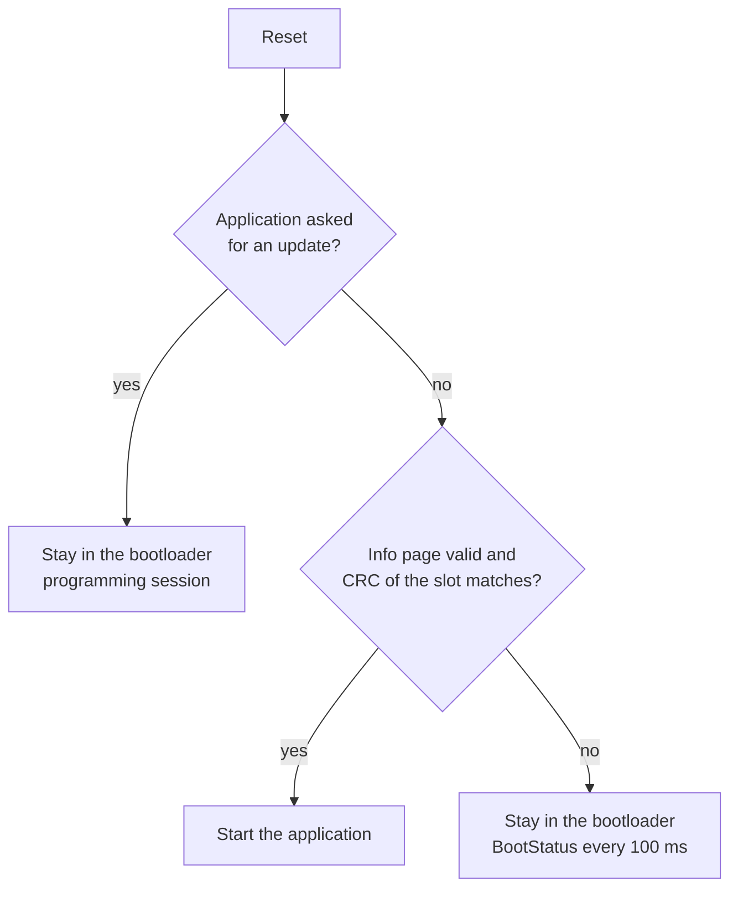

# Firmware update over CAN

In a vehicle, an over-the-air update has two halves. The first brings the image from a
server into the car. The second brings it from the gateway into the ECU, over the vehicle
network, with diagnostic services. This repository covers the second half: the part that
runs on the ECU, and the part where a failure leaves a control unit that does not start.

The bench plays the gateway. No internet connection is involved.

## Flash layout

| Address | Content | Size |
|---|---|---|
| `0x08000000` | Bootloader | 16 kB |
| `0x08004000` | Application slot | 110 kB |
| `0x0801F800` | Info page: length, CRC-32 and version of the installed application | 2 kB |

There is one application slot. This decides what an interrupted update can leave behind:
the old application is erased before the new one arrives, so there is nothing to roll
back to. What the bootloader guarantees instead is that an incomplete or damaged
application is never started, and that the update can always be repeated.

## Start

At every reset the bootloader runs first, before any peripheral is set up.



The CRC is computed over the slot at every start, not only after an update. Flash that
changes later is noticed too.

## Sequence

| Step | Request | What the bootloader does |
|---|---|---|
| 1 | `10 02` programming session | A running application answers and restarts into the bootloader |
| 2 | `31 01 FF 00 <version>` | Checks the version. An older one is refused here, before anything is erased |
| 3 | `34 00 44 <address> <size>` | Checks address and size, answers "response pending" (`7F 34 78`), erases the info page, then the slot, then answers with the block length |
| 4 | `36 <counter> <data>` ... | Programs each block. The counter must be the next one |
| 5 | `37` | Accepts only when all announced bytes have arrived |
| 6 | `31 01 FF 01 <crc32>` | Reads the slot back, compares the CRC, and only then writes the info page |
| 7 | `11 01` | Reset: the start check passes and the application runs |

The order of steps 3 and 6 is the design: the info page is erased first and written
last. Between those two moments there is no valid application, whatever happens.

## Faults and what must happen

| Fault | Injection | Expected | Requirement |
|---|---|---|---|
| Update stops midway | The bench stops sending after n blocks, then resets the ECU | No application starts. The bootloader waits. A repeated update succeeds | UPD-02 |
| Reset without warning | The model resets the ECU between two blocks | Same | UPD-02 |
| Data damaged on the way | One bit of one block is flipped | Step 6 fails with NRC `0x72`. The image is not activated | UPD-03 |
| Flash changes after installation | One bit of the installed image is flipped in the model | The next start does not run the application | UPD-01 |
| Lost, repeated or reordered block | Wrong block counter | NRC `0x73`. The expected block is still accepted | UPD-04 |
| Steps out of order, too much data | Requests without their predecessor | NRC `0x24`, NRC `0x31` | UPD-04 |
| Older version | Version below the installed one | Refused in step 2. The installed application keeps running | UPD-05 |
| Image that does not fit, wrong address | Size or address outside the slot | Refused in step 3 before erasing. The installed application keeps running | UPD-05 |
| Tester goes silent | No request for 5 s | The bootloader leaves the programming session and drops the download | UPD-06 |

## What is verified, and where

- **In simulation:** all of the above, 34 tests. The bootloader is the real C code. Flash is
  a model that refuses to program bytes that were not erased, so a missing erase is a
  test failure and not a silent success.
- **In the build:** the bootloader and both application versions are linked for their
  parts of flash, and `python -m tools.check_images` checks the vector tables against
  the layout.
- **On the board:** not yet. The jump from the bootloader to the application, the real
  flash timing and the erase under the watchdog can only be shown there.

## On the board

```bash
pio run -d firmware -e bootloader -t upload
```

```bash
pio run -d firmware -e app_v100 -e app_v110
```

```bash
python -m bench.updater --can-channel COM5 --image firmware/.pio/build/app_v100/firmware.bin --version 1.0.0
```

```bash
pytest --target hil --can-channel COM5 --bootloader tests/test_update.py -v
```

While the bootloader runs, LD2 blinks briefly once per second.

## Limits

- No authentication. Anyone on the bus can install an image. A real ECU requires
  SecurityAccess before programming and verifies a signature, not only a CRC. A CRC
  protects against damage, not against a wrong sender.
- One slot, so no rollback to the previous version.
- The version check compares numbers. It does not prevent installing the same version again.
- The bootloader itself cannot be updated.
